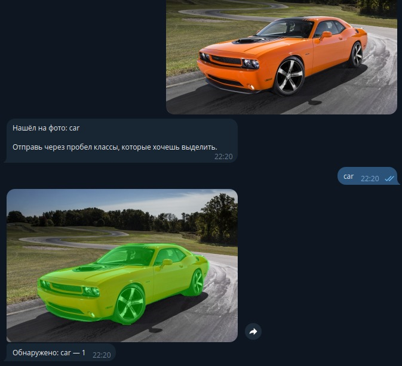
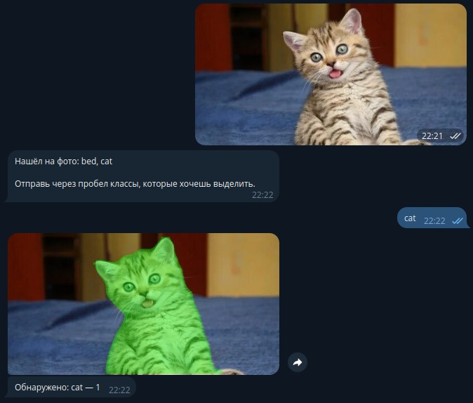

# Telegram-бот для детекции и zero-shot сегментации изображений

## Итоговое задание по CV

**Ссылка на бота:** [yolodetector_bot](https://t.me/yolodetector_bot)  
**Репозиторий:** [GitHub](https://github.com/lexgp/HMCV_final)

---

## Описание

Это Telegram-бот, который выполняет два основных этапа обработки изображений:

1. **Детекция объектов** с помощью YOLOv8.
2. **Zero-shot сегментация** выбранных пользователем классов с наложением масок на исходное изображение.

Пользователь отправляет фото в чат с ботом, бот возвращает список обнаруженных классов. После выбора классов бот визуализирует маски для выбранных объектов и возвращает изображение с наложением масок, а также статистику по количеству объектов каждого класса.

---

## Как работает бот

### 1. Отправка фотографии
Пользователь отправляет фотографию в чат с ботом.

**Пример:**

  


### 2. Получение списка классов
Бот анализирует изображение с помощью YOLOv8 и возвращает список найденных объектов.

**Пример сообщений бота:**
```
Нашёл на фото: car, person, traffic light

Отправь названия классов через пробел, которые хочешь выделить маской.
```

### 3. Выбор классов и сегментация
Пользователь отправляет сообщение с названиями классов, например:
```
car
```
Бот накладывает маски на объекты выбранного класса.

**Пример результата:**



Для второго фото можно выбрать несколько классов:
```
cat bad
```
**Результат сегментации:**



### 4. Статистика
Бот отправляет текстовое сообщение с количеством найденных объектов для каждого выбранного класса.

**Пример:**
```
Обнаружено: car — 2
```
```
Обнаружено: cat — 1, bad — 3
```

---

## Установка и запуск

1. Клонируем репозиторий:
```bash
git clone https://github.com/lexgp/HMCV_final.git
cd HMCV_final
```

2. Устанавливаем зависимости:
```bash
pip install python-telegram-bot==20.3 ultralytics opencv-python numpy<2
```

3. Запускаем бота:
```bash
python bot_seg.py
```

---

## Используемые технологии
- Python 3.9+
- Telegram Bot API (python-telegram-bot 20.3)
- Ultralytics YOLOv8 (det & seg)
- OpenCV для визуализации масок
- NumPy (<2)

---

## Примеры использования
- Фото 1: класс `car` выделен маской.
- Фото 2: классы `cat` и `bad` выделены масками.

Скриншоты работы бота можно посмотреть выше.

---

Автор: Алексей Зырянов

Проект выполнен в рамках итогового задания по курсу Computer Vision.
